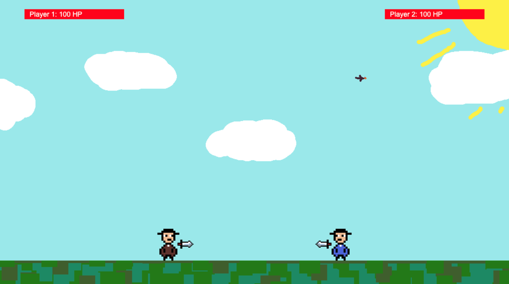

# Fighting Game with Canvas

A simple 2D fighting game created using the Canvas API and vanilla JavaScript.



## How to Play

### Player One:

- Movement: WASD
- Attack: Space

### Player Two:

- Movement: Arrow Keys
- Attack: Shift

## How to Run

Clone this repository:

```bash
git clone https://github.com/mariovyord/fighting-game.git
```

Open `index.html` in any modern browser.
